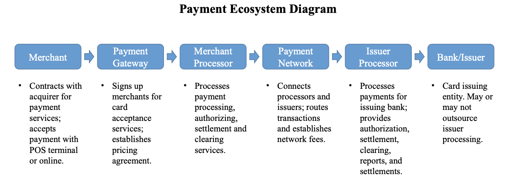
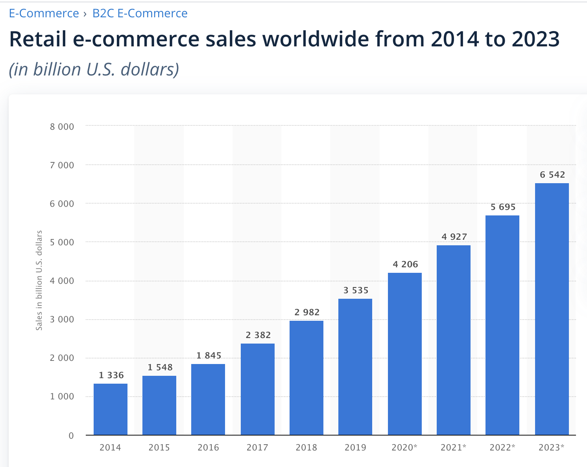

# Case Study - Stripe, Inc.

## by Jeremy Radcliffe
### October 2020

---

## Overview and Origin

Stripe, Inc incorporated in 2010 and was founded by teenage entrepreneurs John and Patrick Collison - Irish-born brothers who dropped out of Harvard and MIT to make it easier for online businesses to collect payments.  

The brothers showed early signs of entreprenueral chops by selling their first business in 2008, Auctomatic, at the ages of 17 and 19 making them millionaires over night.  Eight years later in 2016 - after Stripe's valuation of $9.2 billion, John and Patrick became the world's youngest billionaires. The idea came about in 2010 out of the founder's personal experience of the difficulty in setting up e-commerce websites on their own projects.  <sup>[1](#1)</sup>


> *“Stripe really did come about because we were really appalled by how hard it was to charge for things online.”* — John Collison <sup>[2](#2)</sup>

The brothers found it a worthy challenge and over the course of two weeks prototyped a solution that processed their first credit card transaction.  Being avid developers themselves - they beta tested their solution with the developer community and made quick iterations that grew in popularity as a "developer friendly" option for businesses to start receiving online payments immediately.  Their product was a welcomed contrast to having to wait in some instances days or weeks for merchant account approval if given at all.<sup>[3](#3)</sup>
    
The simple goal was to make it as easy as possible to implement and the earliest versions of Stripe's setup only required the following 7 lines of code being added to a business checkout page to start receiving online payments.

> *“We wanted it to be extremely simple to integrate. You should be able to start charging credit cards immediately. There shouldn’t be any latency. You shouldn’t have to talk to anybody. The information you have to give shouldn’t be pages long… Google Checkout and PayPal are these confusing things, and we wondered why they hadn’t solved these issues.”* — Patrick Collison <sup>[sos]()</sup>

**Stripe's Sample Checkout Code**   <sup>[4](#4)</sup>

```
<form action="/purchase" method="POST">
<script
    src="https://checkout.stripe.com/checkout.js"
    class="stripe-button"
    data-key="pk_test_TYooMQauvdEDq54NiTphI7jx"
    data-name="Custom t-shirt"
    data-description="Your custom designed t-shirt"
    data-amount="{{ORDER_AMOUNT}}"
    data-currency="usd">
</script>
</form>
```

The brothers saw a massive opportunity with obvious hurdles.

> *As we built Auctomatic, we interacted with dozens of small and medium-sized business, and we learned how hard it was to accept payments as an online business.  People would apply for a merchant account, and it required heaps of paperwork and an elaborate approval process.  Many business were rejected because they didn't have a history of receipts -- but how were they supposed to have a business history if they couldn't get a merchant account?  And even if they could get a merchant account, they got one product - the ability to accept credit card payments in a single transaction.  This didn't allow for recurrring payments, marketplaces, or other complex types of transactions.    Nor did it allow businesses to capture data associated with their transactions.  This system didn't make sense.  People could build services and products that reached people around the world through the Internet, yet they couldn't get paid.  It got us thinking that there had to be a better way of doing things.* - John Collison <sup>[5](#6)</sup>

Stripe finished Series G Funding as of April 2020.  They have currently raised $1.6 billion from lead VC firms like Sequioia Capital, General Catalist, Tiger Global Management and DST Global.  As of 2020 - Stripe's latest valuation of $35 billion makes it the most valuable private fintech in the U.S.<sup>[6](#6)</sup>


## Business Activities:

Stripe's mission is "to increase the GDP of the internet" by creating a suite of APIs that give businesses of every size the ability to accept payments and manage their business online. They are focused on the economic infrastructure for the internet by providing a range of flexible tools for businesses to customize their payment processes.<sup>[7](#7)</sup>

Prior to Stripe - doing business online was no small challenge trying to navigate the financial system of setting up merchant accounts, currency challenges for international transactions or complex transactions like recurring payments.  Stripe's services helps customers bypass these hurdles allowing them to focus on growing their businesses and not the technical quirks of taking payments online.

What started out with the idea of simplifying payment setup for the internet has now morphed into a mission of impacting economic growth around the world.  That now includes products like Stripe Connect for social commerce and online marketplaces as we see with Shopify, and more recently the creation of Atlas which helps international businesses quickly create a valid legal presence in the United States with tax ids and bank accounts broadening their reach.<sup>[8](#8)</sup>  Stripe sees itself as the champion for frictionless trade across boarders.

### **Background**
#### **Steps to a Credit Card Transaction** <sup>[6.1](#6)</sup>

You experience it on a daily basis but it's worth diving into the process of what happens when a customer uses their credit card with a merchant.

- 1.  Merchant contracts with payment gateway
- 2.  Payment gateway receives the transaction request and submits it to the merchant bank's processor using a secure site connection
- 3.  Merchant bank's processor sends the transaction to the credit car network who then forwards the transaction request to the issuing bank for the customer's credit card.
- 4.  Issuing bank then accepts or refuses the transaction based on the transaction and customer's available funds and sends the results back to the credit card network.  
- 5.  Credit card network  transmits the results to the merchant bank's processor which then sends the results to the payment gateway.  
- 6.  The results of transaction were saved and available to the merchant and customer.  If transaction was approved the customer's credi-card issuing bank would send funds to the credit card network, which then sends funds to the merchant's bank.  Round trip process taking < 3 seconds with funds being available to the merchant within two to four business days.

<sup>[xx](#xx)</sup>

### People who make things on the web
<br>

> “Our target audience is the people making things on the web” - Patrick Collison <sup>[2.1](#2)</sup>

Stripe is positioning it's suite of apis and services to serve the internet shopper.  With projected retail e-commerce sales worldwide to be over $4 trillion for 2020 and eclipsing $6 trillion by 2023 Stripe is well positioned to profit from the year over year growth.  With the continual growth of internet access and mobile payment options the opportunities seem endless in the near future. 



Stripe has also introduced Machine Learning for their new lending platform that allows for no contact approvals based as well as AI to analyze fraudulent charges with their fraud product, Radar.

## Landscape:

As of 2000, e-commerce accounted for less than 1 percent of all U.S. retail sales; twenty years later that figure is now over 16% as of 2020.  Stripe wants to help businesses grow and take advantage of online sales growth by being the premier infrastructure for payment processing and transaction management.

The move away from cash and credit card transactions to digital payment methods is one of the most significant changes in the landscape of payments.  440 million users took advantage of digital payment options in 2018, that is expected to grow to 760 million in 2020.<sup>[8](#8)</sup>
  
Online shopping is one of the most popular online activities worldwide.  According to a 2017 study by Capgemini and BNP Paribas, people worldwide will make 726 billion digital transactions by 2020.  Social payments

#### **Competition and Incumbents**
Stripe is not alone in the payment space.

Braintree Payment Solutions also provides white-labeled tools for mobile developers to process payments.  Braintree was originally founded in 2007 and later purchased by Paypal for $800 million in 2013.  In 2018 - Braintree processed 6 Billion in transactions as one of Paypal's services.  Top customers for Braintree include Uber, TaskRabbit.  Adyen is another well known competitor in the payments space.  Based out of Amsterdam and founded in 2016 - Adyen opened up payments online, offline and in applications.<sup>[6.2](#6)</sup>  Known customers include Netflix, Spotify, Dropbox and ifood.

Braintree and Adyen serve mostly as the role of payment gateways and do not solve some of the more nuanced problems of recurring payments and subscription billing.

Other direct competitors:<sup>[10](#10)</sup>

- Square
- 2Checkout
- Authorize.net
- 2Checkout
- Payline Data

Stripe  also has inherit competition with the financial incumbents as well.  In many cases Strip has taken on the attitude of "everyone grows" but there have been concerns of the credit card networks and large banks building their own payment infrastructures.  Stripe has maintained that what's good for the banks and credit card networks is good for the internet business and the the online shopper and is also good for Stripe.

According to Stripe - they are handlings hundreds of billions of dollars worth in transactions annually <sup>[9](#9)</sup> and have partnered with household names like Lyft, Target and Shopify.

Even if a card is new to an online business, there’s an 89% chance it’s been seen before on the Stripe network.<sup>[5](#5)</sup>


## Days Ahead

**If you were to advise the company, what products or services would you suggest they offer? (This could be something that a competitor offers, or use your imagination!)**

Stripe has enjoyed ten amazing years but it's crucial that they see peak inside the looking glass at the future of payments.  Disruptive technologies like digital currencies and smart contracts will grow in adoption and though the threat of fiat currency disappearing is almost none - the author would argue that we never expected a global pandemic in 2020 either.  

I see payments in the future being less tied to plastic in our wallets or phones in our pockets but more on our physical persons.  It's a scary idea to imagine being able to pay for your instacart groceries via a retinal scan or facial recognition but the future is faster than we imagine. 

Another area that seems to be trending with the explosion of e-commerce is that of fraud and indentity theft.  Growing datasets will allow for companies like Stripe to stop fraudulent activity early on with technologies trained to recognize abnormalities in actvity.

Where I see Stripe's future is in it's ability to monetize their data.  With millions of transactions processed per year - Strip is sitting on a gold mine of data that shows 


**Why do you think that offering this product or service would benefit the company?**

**What technologies would this additional product or service utilize?**

**Why are these technologies appropriate for your solution?**

---
---

* https://www.statista.com/statistics/379046/worldwide-retail-e-commerce-sales/


### Sources
- #### [1](https://en.wikipedia.org/wiki/Stripe_(company))
    - https://en.wikipedia.org/wiki/Stripe_(company)
- #### [2](https://www.fastcompany.com/1813087/inside-stripe-paypal-competitor-backed-paypal-founders-peter-thiel-elon-musk#:~:text=Adds%20John%2C%20%E2%80%9CStripe%20really%20did,to%20charge%20for%20things%20online.%E2%80%9D&text=Essentially%2C%20Stripe%20is%20a%20straightforward,their%20websites%20to%20accept%20payments.)
    - https://www.fastcompany.com/1813087/inside-stripe-paypal-competitor-backed-paypal-founders-peter-thiel-elon-musk#:~:text=Adds%20John%2C%20%E2%80%9CStripe%20really%20did,to%20charge%20for%20things%20online.%E2%80%9D&text=Essentially%2C%20Stripe%20is%20a%20straightforward,their%20websites%20to%20accept%20payments.
- #### [3](https://techcrunch.com/2012/05/20/the-story-behind-payment-disruptor-stripe-com-and-its-founder-patrick-collison/#:~:text=John%20and%20Patrick%20first%20started,had%20processed%20their%20first%20transaction)
    - https://techcrunch.com/2012/05/20/the-story-behind-payment-disruptor-stripe-com-and-its-founder-patrick-collison/#:~:text=John%20and%20Patrick%20first%20started,had%20processed%20their%20first%20transaction
- #### [4](https://www.crunchbase.com/organization/stripe)
    - https://www.crunchbase.com/organization/stripe
- #### [5](https://www.stripe.com)
    - https://www.stripe.com
- #### [6](#)
    - Robert Siegel and Ryan Kissick, “Stripe: Increasing the GDP of the Internet” HBS No. E601 (Stanford Graduate School of Business, 2016), http://hbsp.harvard.edu, accessed October 2020.      
- #### [7](https://www.braintreepayments.com/blog/reflections-on-our-growth-in-2018-and-beyond)
    - https://www.braintreepayments.com/blog/reflections-on-our-growth-in-2018-and-beyond
- #### [8](https://www.statista.com/statistics/379046/worldwide-retail-e-commerce-sales/)
    - https://www.statista.com/statistics/379046/worldwide-retail-e-commerce-sales/
- #### [9](https://www.techradar.com/best/best-payment-gateways)
    - https://www.techradar.com/best/best-payment-gateways
- #### [10](https://www.fundera.com/blog/stripe-competitors)
    - https://www.fundera.com/blog/stripe-competitors
  #### [11](https://thefinancialbrand.com/68186/digital-payments-banking-mobile-fintech-trends/#:~:text=Digital%20payments%20worldwide%20are%20predicted,by%20Capgemini%20and%20BNP%20Paribas.)
    - https://thefinancialbrand.com/68186/digital-payments-banking-mobile-fintech-trends/#:~:text=Digital%20payments%20worldwide%20are%20predicted,by%20Capgemini%20and%20BNP%20Paribas.
  #### [12]()
    - https://www.cbinsights.com/research/report/stripe-teardown/

